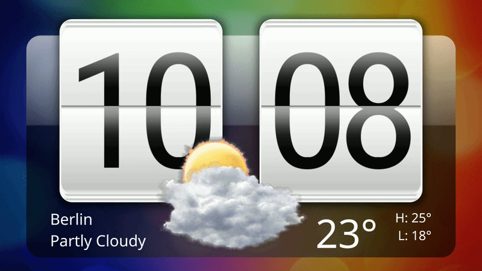

# Flip Clock for KDE Plasma 6

A polished, skeuomorphic flip-clock widget for KDE Plasma 6, inspired by the
classic HTC Sense clock.



## Requirements

Plasma 6.7 or newer.

## Install

Download the `.plasmoid` file from a release, then run:

```bash
kpackagetool6 --type Plasma/Applet --install ./io.github.pruefsumme.flipclock-0.1.0.plasmoid
```

Add **Flip Clock** as a desktop widget. To update an existing installation,
replace `--install` with `--upgrade`.

## Highlights

- Animated two-phase hour and minute card flips
- 12-hour and 24-hour formats, date, and custom text strips
- Optional Plasma weather readout with original layered illustrations
- Configurable time zone and animation settings

## Development

```bash
export PATH=/usr/lib/qt6/bin:$PATH
qmllint -I /usr/lib/qt6/qml -I package/contents/ui package/contents/ui/*.qml
```

Render a fixed scene and compare it with the project’s pixel-diff tooling:

```bash
tools/snap.sh DiffProbe.qml 996 566 tools/out/render.png
tools/pixdiff.py tools/out/render.png --write-diff tools/out/diff.png
```

## Weather

Weather is opt-in. Enable **Show weather** in the widget settings to reuse an
active source from Plasma's standard `weather` engine, or select a city or
station for Flip Clock to use directly. No separate weather-service account is
required.

The readout includes location, condition, temperature, range, and 12 original
layered weather states. KWeather saved places are not read directly; select the
same location once in Flip Clock if needed.

## License

[AGPL-3.0-or-later](LICENSE). The bundled Roboto Condensed font remains under
the SIL Open Font License 1.1; see [LICENSE.txt](package/contents/fonts/LICENSE.txt).
