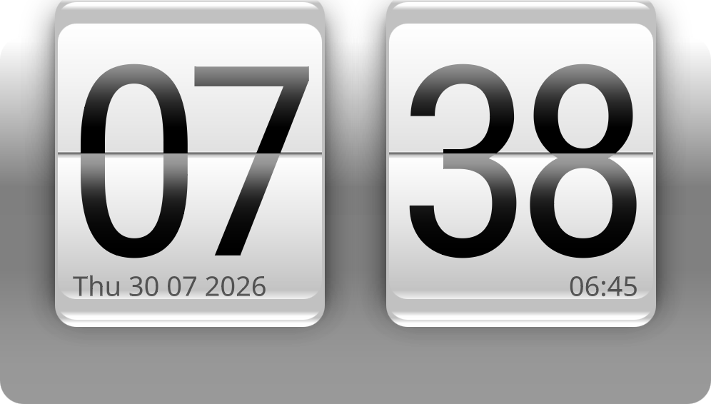

# Flip Clock for KDE Plasma 6

A skeuomorphic flip-clock widget for KDE Plasma 6, inspired by the classic HTC Sense
clock. Man, things used to have class back in the day.



## Install

```bash
kpackagetool6 --type Plasma/Applet --install ./package
```

Add **Flip Clock** as a desktop widget. To update an existing installation:

```bash
kpackagetool6 --type Plasma/Applet --upgrade ./package
```

## Features

- Animated two-phase hour and minute card flips
- 12-hour and 24-hour time formats
- Optional date and custom text strips
- Optional Plasma weather readout with 12 original layered weather states
- Day-stable cloud variation and a restrained drift/fade between conditions
- Configurable time zone and animation settings
- Measurement and rendering tools for development

## Development

```bash
export PATH=/usr/lib/qt6/bin:$PATH
qmllint -I /usr/lib/qt6/qml -I package/contents/ui package/contents/ui/*.qml
```

Render a fixed scene and compare it with the project’s pixel-diff tooling:

```bash
tools/snap.sh DiffProbe.qml 996 566 tools/out/render.png
tools/pixdiff.py tools/out/render.png --write-diff tools/out/diff.png
```

## Weather

Weather is opt-in. Enable **Show weather** in the widget's settings. By default,
the widget reuses an active compatible source from Plasma's standard `weather`
engine. This is the broadest Plasma Desktop integration: it uses installed
providers and does not require a separate web-service account or KWeather.

If no compatible source is already active—or if you prefer this widget to use
its own location—search for a city or weather station in the same settings and
select a result. Flip Clock stores the provider's canonical source itself. Turn
off **Automatically reuse an active Plasma weather source** to make that chosen
location take precedence. The widget reads the engine's place, condition,
temperature, range, and freedesktop `Condition Icon` fields.

KWeather's saved places are intentionally not read directly: it is an optional
application with a separate configuration format, while the Plasma weather
engine is part of the normal desktop stack. Select the same city once in Flip
Clock if KWeather is the only app currently configured.

The weather catalog contains clear, partly cloudy, cloudy, rain, snow, storm,
clear night, partly cloudy night, fog, wind, hail/freezing rain, and dust/haze.
The illustrations are original transparent artwork made for this project in the
clock's soft photographic/airbrushed material style. Sun, moon, clouds, and
precipitation are independent textures rather than twelve baked combinations.
Cloud count and offsets vary deterministically by place and day, so the scene
changes naturally without jumping on every provider refresh. Freedesktop
day/night and severe-weather names are mapped directly, with a quiet cloud as
the unknown-condition fallback.

## License

GPL-3.0-or-later. The bundled Roboto Condensed font is licensed under the SIL
Open Font License 1.1; see [LICENSE.txt](package/contents/fonts/LICENSE.txt).
